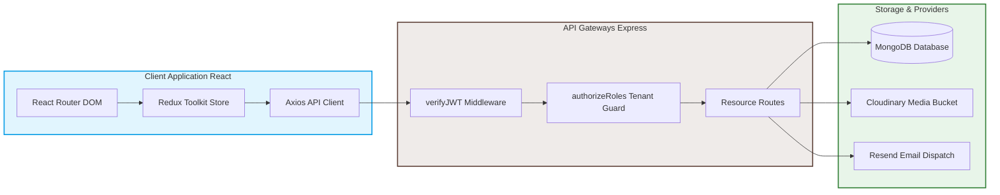

# InClient — Tenant-Aware Invoice & Client Management Platform

<p align="center">
  <a href="https://github.com/bhargablinx/invoice-client-management/blob/main/LICENSE">
    
  </a>
  
  
  
  
  
</p>

---

**InClient** is a full-featured, self-hostable, multi-tenant billing engine and client directory platform built for freelancers, consultants, and agencies. It groups clients, service catalogs, invoices, payments, and team memberships in a fast, modern, and tenant-isolated dashboard experience.

> 📺 **[Watch Demo Video](https://youtu.be/L6rMdd1CJ3Q)** &nbsp;|&nbsp; 🌐 **[Live Application Preview](https://inclient.netlify.app)**
>
> 🔑 **Demo Sandbox Account**:
> * **Email**: `one@example.com`
> * **Password**: `12345678`

---

## 📸 Product Preview

<table border="0">
  <tr>
    <td width="50%">
      <p align="center"><b>Modern Marketing Landing Page</b></p>
      
    </td>
    <td width="50%">
      <p align="center"><b>Analytics Metrics Dashboard</b></p>
      
    </td>
  </tr>
  <tr>
    <td width="50%">
      <p align="center"><b>Dynamic Invoice Editor</b></p>
      
    </td>
    <td width="50%">
      <p align="center"><b>Payments Ledger & History</b></p>
      
    </td>
  </tr>
</table>

---

## ✨ Platform Features

* **Multi-Tenancy Isolation**: Strong boundaries ensuring that memberships, configurations, services, and transactions are strictly scoped to the active tenant/organization.
* **Role-Based Access Control (RBAC)**: Fine-grained permissions for **Owner**, **Admin**, and **Member** roles.
* **Service Catalog Registry**: Standardizes invoice generation. Users save services with preset pricing and tax criteria, then auto-fill invoice line items.
* **Dynamic Invoice Calculations & Duplication**: Handles line item totals, tax rates, discount deductions, subtotals, balance tracking, and one-click atomic transaction invoice duplication (`duplicateInvoice`).
* **Vector PDF Generation & Export**: Built-in server-side PDFKit rendering engine to preview invoices inline or trigger direct attachment PDF file downloads.
* **Email Invoice Dispatching**: Automatic generation of rich HTML invoice notifications sent to client email addresses via Resend integration (`sendInvoice`).
* **Real-time Payments Ledger & Modification**: Log, edit, or delete partial/full payments. Balances are recalculated in real time within Mongoose transactions, updating invoice status to `partially_paid` or `paid`.
* **Enterprise Security Suite**:
  - **CSRF Protection**: Custom double-submit token verification middleware.
  - **Security Headers**: Integrated `helmet` (CSP, HSTS, X-Frame-Options, X-Content-Type-Options: nosniff) and disabled Express `x-powered-by` header.
  - **Brute-Force Rate Limiting**: Endpoint protection via `express-rate-limit` for global and authentication routes.
  - **Injection & Path Traversal Shields**: ReDoS meta-character escaping and randomized UUID file storage (`crypto.randomUUID()`).
  - **Password Complexity Validation**: Enforces length, uppercase, lowercase, numeric, and special character policies across signup and reset workflows.
* **Team Invitation Flow**: Owner and Admin users can invite team members via secure, tokenized onboarding emails.
* **Analytics Engine**: Out-of-the-box charts for monthly revenue growth, invoice state breakdowns, and high-value customer rankings.
* **Soft Deletion Profiles**: Preserves referential integrity by marking user accounts as inactive (`isDeleted: true`) rather than performing hard deletions.

---

## 🏗 System Architecture



---

## 📂 Repository Layout Map

This repository is set up as a decoupled monorepo:

```text
.
├── client/                     # Frontend Client App (Vite + React)
│   ├── src/
│   │   ├── api/                # API communication layers
│   │   ├── components/         # Shared components (ui, dashboard, landing)
│   │   ├── features/           # Redux slices and thunks (auth, invoices, etc.)
│   │   ├── hooks/              # Custom layout and data React hooks
│   │   ├── layouts/            # Auth and Protected route wrappers
│   │   ├── pages/              # Main route views
│   │   └── store/              # Redux RTK Bootstrap config
│   ├── package.json
│   └── vite.config.js
│
├── server/                     # Backend API App (Express 5 + Node.js)
│   ├── src/
│   │   ├── controllers/        # Request handlers and business logic
│   │   ├── db/                 # Database initialization and connection pool
│   │   ├── middlewares/        # Authentication, RBAC, and error handlers
│   │   ├── models/             # Mongoose schemas (9 models)
│   │   ├── routes/             # Modular sub-routers (clients, invoices, etc.)
│   │   └── utils/              # Responders, errors, and mail templates
│   ├── package.json
│   └── index.js
│
└── docs/                       # Global system documentation
```

---

## 🚀 Getting Started

### Prerequisites
* **Node.js**: `v18.x` or newer
* **MongoDB**: A running local or remote instance
* **Media bucket**: A Cloudinary developer account for organization logos
* **Email API**: A Resend API key for invitations and verification

### 1. Clone & Install

```bash
git clone https://github.com/bhargablinx/invoice-client-management.git
cd invoice-client-management

# Install frontend dependencies
cd client && npm install

# Install backend dependencies
cd ../server && npm install
```

### 2. Configuration Setup

<details>
<summary><b>Backend Environment Setup (server/.env)</b></summary>

Create a `.env` file in the `server/` directory and configure the variables:

```env
PORT=5000
MONGODB_URL=mongodb://127.0.0.1:27017/inclient

CORS_ORIGIN=http://localhost:5173
CLIENT_URL=http://localhost:5173

ACCESS_TOKEN_SECRET=your_jwt_access_token_secret_key
ACCESS_TOKEN_EXPIRY=15m
REFRESH_TOKEN_SECRET=your_jwt_refresh_token_secret_key
REFRESH_TOKEN_EXPIRY=7d

# Media Uploads (Cloudinary)
CLOUDINARY_CLOUD_NAME=your_cloudinary_cloud_name
CLOUDINARY_API_KEY=your_cloudinary_api_key
CLOUDINARY_API_SECRET=your_cloudinary_api_secret

# Email Service (Resend)
RESEND_API_KEY=re_your_resend_api_key
```
</details>

<details>
<summary><b>Frontend Environment Setup (client/.env)</b></summary>

Create a `.env` file in the `client/` directory and specify the API gateway URL:

```env
VITE_API_BASE_URL=http://localhost:5000/api/v1
```
</details>

### 3. Launch Development Environments

Open two terminal sessions to run both servers:

```bash
# Terminal 1: Run Backend API Server
cd server
npm run dev

# Terminal 2: Run Frontend Client App
cd client
npm run dev
```

Your browser should open `http://localhost:5173` showing the login portal.

---

## 🛠 Available CLI Scripts

### Client Workspace
* `npm run dev`: Launch the local hot-reloading Vite server.
* `npm run build`: Compile static React files into `/dist` for production.
* `npm run lint`: Run high-speed static analysis via Oxlint.
* `npm run preview`: Boot a preview server to test the compiled `/dist` build.

### Server Workspace
* `npm run dev`: Launch the backend API server with Nodemon tracking.
* `npm start`: Launch the backend server in production mode.

---

## 📝 API Integration Spec Index

All requests are scoped under `/api/v1` and use standard JSON responses. Refer to our dedicated specs:

* 📄 **[glossary / Definitions](file:///home/bhargab/WebD/invoice-client-management/docs/Definition.md)**
* 📄 **[API Endpoint List](file:///home/bhargab/WebD/invoice-client-management/docs/EndPoints.md)**
* 📄 **[Database Schemas](file:///home/bhargab/WebD/invoice-client-management/docs/Entities.md)**
* 📄 **[Request & Response Payload Formats](file:///home/bhargab/WebD/invoice-client-management/server/documentation/RequestStructure.md)**
* 📄 **[Codebase Security Audit & Production Report](file:///home/bhargab/WebD/invoice-client-management/docs/ideas.md)**

---

## 🤝 Contribution Guidelines

We welcome contributions to InClient! Here is how you can help:

1. **Fork** the repository and create your feature branch: `git checkout -b feature/amazing-feature`.
2. **Lint check**: Run `npm run lint` inside `client/` to make sure there are no syntax warnings.
3. **Commit** clean changes following standard git convention.
4. **Push** your changes: `git push origin feature/amazing-feature` and open a Pull Request.

---

## 📄 License

Distributed under the **ISC** License. See the [LICENSE](file:///home/bhargab/WebD/invoice-client-management/LICENSE) file for more details.
