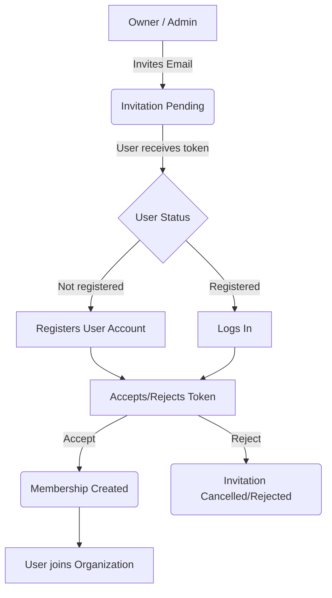
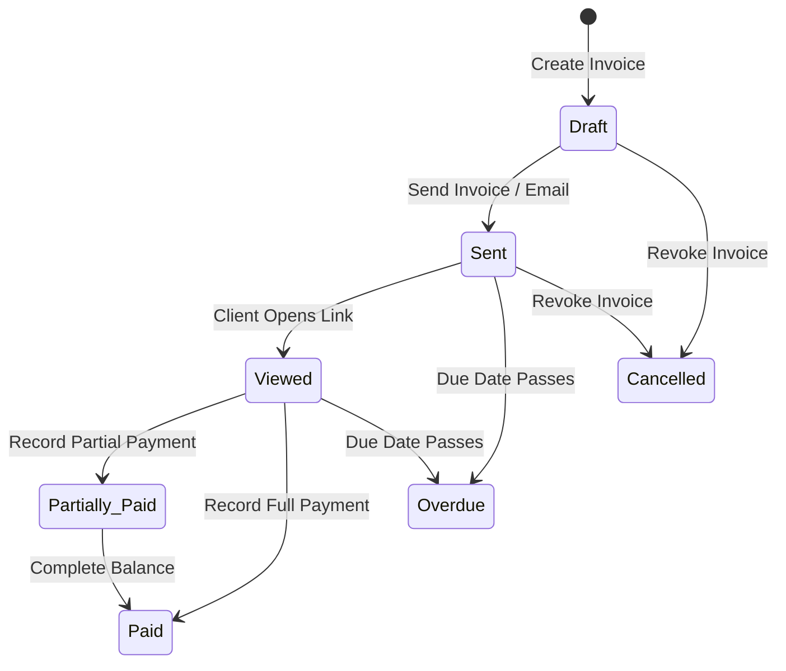

# InClient Terminology & Definition Glossary

This document serves as a glossary of domain concepts and technical terminology used across the InClient platform.

---

## 1. Core Platform Concepts

### Multi-Tenancy
InClient is designed as a multi-tenant platform. An **Organization** acts as the tenant boundary. All clients, invoices, payments, services, and team memberships are scoped strictly to an organization. A user may belong to multiple organizations and switch between them dynamically.

### Tenant Isolation
The security practice of ensuring that users can only view or modify records belonging to organizations they are active members of. This is enforced by querying records using organization parameters and validating memberships via role authorization middlewares.

---

## 2. Jargon Glossary

### Service Catalog
A registry of predefined services/products offered by an organization (e.g. "Web Development", "Consulting Hour"). Instead of manually writing line items and prices every time an invoice is created, users select from the catalog.

### Invitation
A resource representing a pending offer to join an organization.
* **Token-based Onboarding**: The recipient receives an invitation with a unique token.
* **Security Validation**: The recipient must authenticate to accept or reject the invitation.

### Membership
A relation connecting a specific `User` with an `Organization` under a designated `Role`. This governs the user's permissions when accessing that organization's data.

### Soft Delete
The practice of hiding records instead of deleting them permanently from the database. For user accounts, setting `isDeleted: true` preserves database foreign key references while blocking login access.

---

## 3. Workflow Diagrams

### Invitation & Onboarding Lifecycle

### Invoice Status State Machine

