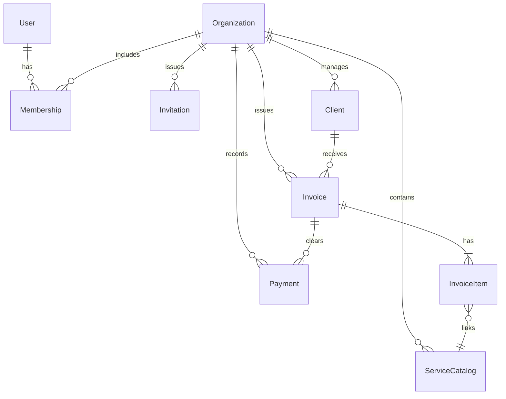

# InClient Schema Entities & Relations Reference

This document covers the Mongoose models representing the data layers of InClient.

---

## 1. Database Entity Dictionary

### User
Stores global user authentication profiles.
* **Fields**:
  * `name` (String, required): Display name.
  * `email` (String, required, unique, indexed): User email (stored lowercase).
  * `password` (String, required): Bcrypt hashed password.
  * `avatar` (String): Cloudinary image URL.
  * `isEmailVerified` (Boolean, default `false`).
  * `emailVerificationToken` (String), `emailVerificationExpiry` (Date).
  * `passwordResetToken` (String), `passwordResetExpiry` (Date).
  * `isDeleted` (Boolean, default `false`): Used for soft deletes.
  * `deletedAt` (Date).

### Organization
Represents a tenant entity (a business or company profile).
* **Fields**:
  * `name` (String, required): Business name.
  * `email` (String): Organization billing email.
  * `phone` (String): Business contact number.
  * `website` (String): Website URL.
  * `logo` (String): Cloudinary image URL of corporate logo.
  * `address` (String): Business physical address.
  * `taxId` (String): Tax ID / VAT / GST reference.
  * `currency` (String, default `"USD"`): Base reporting currency.
  * `timezone` (String, default `"UTC"`): Business operating timezone.

### Membership
Associates a `User` with an `Organization` using a specific role.
* **Fields**:
  * `user` (ObjectId -> User, required): Reference to User.
  * `organization` (ObjectId -> Organization, required): Reference to Organization.
  * `role` (String, enum: `["owner", "admin", "member"]`, default `"member"`): Role level.
* **Indexes**: Unique compound index on `(user, organization)`.

### Invitation
Tracks pending organization invites dispatched via email.
* **Fields**:
  * `organization` (ObjectId -> Organization, required): Reference to Organization.
  * `email` (String, required): Target recipient email.
  * `role` (String, enum: `["admin", "member"]`, default `"member"`): Role to grant upon acceptance.
  * `token` (String, unique): Secret verification token.
  * `expiresAt` (Date): Verification window deadline.
  * `status` (String, enum: `["pending", "accepted", "rejected", "expired"]`, default `"pending"`).
  * `invitedBy` (ObjectId -> User): User who issued the invitation.

### Client
Stores customer profile details.
* **Fields**:
  * `organization` (ObjectId -> Organization, required): Owner tenant.
  * `name` (String, required): Client contact name.
  * `email` (String): Client billing email.
  * `phone` (String): Phone number.
  * `companyName` (String): Client corporate brand name.
  * `address` (String): Client physical address.
  * `taxId` (String): Client's tax identifier.
  * `createdBy` (ObjectId -> User): Creator profile.

### ServiceCatalog
Represents a portfolio of services or products offered by an organization.
* **Fields**:
  * `organization` (ObjectId -> Organization, required): Scope tenant.
  * `name` (String, required): Service title (e.g. "Software Architecture Audit").
  * `description` (String): Detailed catalog information.
  * `unitPrice` (Number, required, min 0): Unit price.
  * `unit` (String, default `"project"`): Unit of measurement (e.g., "hour", "day", "project").
  * `taxRate` (Number, default 0, min 0): Percentage tax rate applied by default.
  * `isActive` (Boolean, default `true`).

### Invoice
Contains invoice header details, calculations, and tracking dates.
* **Fields**:
  * `organization` (ObjectId -> Organization, required): Scope tenant.
  * `client` (ObjectId -> Client, required): Client.
  * `invoiceNumber` (String, required): Unique identifier (e.g. "INV-0001").
  * `status` (String, enum: `["draft", "sent", "viewed", "partially_paid", "paid", "overdue", "cancelled"]`, default `"draft"`).
  * `issueDate` (Date, default `Date.now`): Creation/dispatch date.
  * `dueDate` (Date, required): Deadline.
  * `currency` (String, default `"USD"`).
  * `items` (Array of Subdocuments -> InvoiceItem, required).
  * `subTotal` (Number, required): Sum of items before taxes/discounts.
  * `taxAmount` (Number, default 0): Accumulated tax.
  * `discountAmount` (Number, default 0): Flat deduction.
  * `totalAmount` (Number, required): Net amount (`subTotal + taxAmount - discountAmount`).
  * `amountPaid` (Number, default 0): Collected funds.
  * `balanceDue` (Number, required): Remaining outstanding amount (`totalAmount - amountPaid`).
  * `notes` (String): Public invoice notes.
  * `createdBy` (ObjectId -> User): Creator profile.
* **Indexes**: Unique index on `(organization, invoiceNumber)`.

### InvoiceItem (Subdocument)
Represents a row inside the items array of an `Invoice`.
* **Fields**:
  * `service` (ObjectId -> ServiceCatalog, optional): Link to catalog template.
  * `description` (String, required): Line description.
  * `quantity` (Number, required, default 1, min 0.01): Bill quantity.
  * `unitPrice` (Number, required, min 0): Pricing per unit.
  * `taxRate` (Number, default 0, min 0): Line-specific tax rate.
  * `discountAmount` (Number, default 0): Line-specific discount.

### Payment
Records partial or complete payments allocated to invoices.
* **Fields**:
  * `organization` (ObjectId -> Organization, required): Scope tenant.
  * `invoice` (ObjectId -> Invoice, required): Target invoice.
  * `amount` (Number, required, min 0.01): Paid amount.
  * `paymentDate` (Date, default `Date.now`): Payment date.
  * `paymentMethod` (String, enum: `["bank_transfer", "card", "cash", "paypal", "other"]`, default `"bank_transfer"`).
  * `referenceNumber` (String): Transaction reference (e.g., UTR / Transaction ID).
  * `notes` (String): Payment notes.
  * `recordedBy` (ObjectId -> User): Creator profile.

---

## 2. Relations & Entity Relationship Mapping

