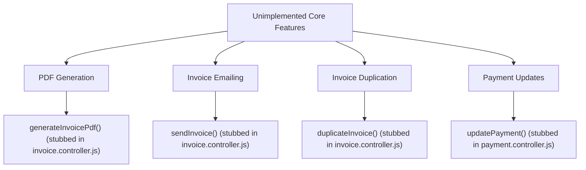
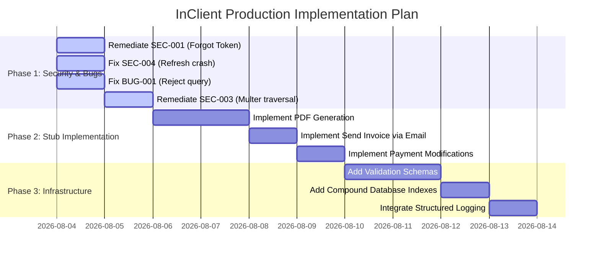

# InClient Production Readiness & Codebase Analysis Report

This report presents a comprehensive security audit, functional bug assessment, and architectural roadmap for **InClient**, transitioning it from a prototype development setup to a robust, secure, and full-fledged production-grade SaaS platform.

---

## Executive Summary

An in-depth review of the InClient client-server workspaces reveals several critical security flaws, a significant logic defect in the invitation module, and multiple unimplemented core workflows (stubbed endpoints). 

Key findings include **token leakage in the password reset payload**, **broken reject-invitation functionality**, **absence of CSRF protection**, and **lack of server-side validation and structured logging**.

By executing the remediation roadmap detailed below, the platform's posture will improve to meet production-level standards.

---

## 1. Security Vulnerability Audit

The following table summarizes the security vulnerabilities found across the backend codebase:

| ID          | Title                                          | Severity     | Status        | Impact                                                                   | Location                                                                                                                                |
| :------------| :-----------------------------------------------| :-------------| :--------------| :-------------------------------------------------------------------------| :----------------------------------------------------------------------------------------------------------------------------------------|
| **SEC-001** | Token Leakage in Password Reset API            | **Critical** | ✅ **FIXED**   | Bypasses email validation, allowing arbitrary account takeover.          | [auth.controller.js:L186-188](file:///home/bhargab/WebD/invoice-client-management/server/src/controllers/auth.controller.js#L186-L188)  |
| **SEC-002** | Absence of CSRF Protection                     | **Critical** | ✅ **FIXED**   | Enables Cross-Site Request Forgery via cookie-based sessions.            | [csrf.middleware.js](file:///home/bhargab/WebD/invoice-client-management/server/src/middlewares/csrf.middleware.js)                     |
| **SEC-003** | Path Traversal / Arbitrary File Write          | **High**     | ✅ **FIXED**   | Trusting raw filenames could lead to remote code execution (RCE).        | [multer.middleware.js:L7-L9](file:///home/bhargab/WebD/invoice-client-management/server/src/middlewares/multer.middleware.js#L7-L9)     |
| **SEC-004** | Missing Error Wrapping on `refreshAccessToken` | **High**     | ✅ **FIXED**   | Unhandled promise rejections can crash the backend server process.       | [auth.controller.js:L284](file:///home/bhargab/WebD/invoice-client-management/server/src/controllers/auth.controller.js#L284)           |
| **SEC-005** | ReDoS / NoSQL Query Parameter Injection        | **Medium**   | ✅ **FIXED**   | Catastrophic regex backtracking blocks Event Loop (Denial of Service).   | [escapeRegex.js](file:///home/bhargab/WebD/invoice-client-management/server/src/utils/escapeRegex.js)                                  |
| **SEC-006** | Missing Brute-Force Rate Limiting              | **Medium**   | ✅ **FIXED**   | Credentials, reset tokens, and endpoints are vulnerable to flooding.     | [rateLimiter.middleware.js](file:///home/bhargab/WebD/invoice-client-management/server/src/middlewares/rateLimiter.middleware.js)         |
| **SEC-007** | Missing HTTP Security Headers                  | **Medium**   | ✅ **FIXED**   | Lack of headers like CSP, HSTS, and Frame options exposes browser shell. | [app.js](file:///home/bhargab/WebD/invoice-client-management/server/src/app.js)                                                         |
| **SEC-008** | Insecure Hardcoded Cookies in Development      | **Low**      | ✅ **FIXED**   | Dev environments served over HTTP fail to store secure session cookies.  | [auth.controller.js:L13-L16](file:///home/bhargab/WebD/invoice-client-management/server/src/controllers/auth.controller.js#L13-L16)     |
| **SEC-009** | Information Leakage via `X-Powered-By` Header  | **Low**      | ✅ **FIXED**   | Leaks Express.js runtime framework to external observers.                | [app.js](file:///home/bhargab/WebD/invoice-client-management/server/src/app.js)                                                         |
| **SEC-010** | Lack of Password Complexity Enforcements       | **Low**      | ✅ **FIXED**   | Allows users to choose highly guessable or weak passwords.               | [passwordValidator.js](file:///home/bhargab/WebD/invoice-client-management/server/src/utils/passwordValidator.js)                       |

### Detailed Findings & Remediation

#### SEC-001: Token Leakage in Password Reset API (Status: ✅ FIXED)
> [!CAUTION]
> **Impact Statement**: An attacker can reset the password of any user by submitting their email address and extracting the generated token directly from the API response body, bypassing the email verification barrier completely.

* **Evidence**:
  ```javascript
  res.status(200).json(
      new ApiResponse(200, resetToken, "Mail sent to your inbox!")
  );
  ```
* **Remediation**: Remove `resetToken` from the response payload. The token must only be sent via the verification email template.
  ```javascript
  res.status(200).json(
      new ApiResponse(200, null, "If the email exists, a password reset link has been dispatched.")
  );
  ```

#### SEC-002: Absence of CSRF Protection (Status: ✅ FIXED)
> [!WARNING]
> **Impact Statement**: Cookie-based credentials (`req.cookies.accessToken`) will be automatically appended by browsers in cross-site requests, making state-changing routes vulnerable to unauthorized actions by third-party malicious sites.

* **Evidence**: [auth.middleware.js](file:///home/bhargab/WebD/invoice-client-management/server/src/middlewares/auth.middleware.js#L9-L25) extracts accessToken from cookies without additional header confirmation or CSRF tokens.
* **Remediation**: Check for custom headers (such as `X-Requested-With` or a dedicated CSRF double-submit token) on all state-changing routes (`POST`, `PUT`, `PATCH`, `DELETE`). Enforce `SameSite: "Lax"` or `"Strict"` on cookies.

#### SEC-003: Path Traversal in Multer Disk Storage (Status: ✅ FIXED)
> [!WARNING]
> **Impact Statement**: Utilizing the user-submitted file name allows path traversal patterns (e.g. `../../app.js`), enabling arbitrary files to be written in the server source directory.

* **Evidence**:
  ```javascript
  filename: function (req, file, cb) {
      cb(null, file.originalname);
  }
  ```
* **Remediation**: Generate a cryptographically secure, randomized filename (using UUIDs or random bytes) and append the original file extension.
  ```javascript
  const uniqueSuffix = crypto.randomUUID();
  cb(null, uniqueSuffix + path.extname(file.originalname));
  ```

#### SEC-004: Missing Error Wrapping on `refreshAccessToken` (Status: ✅ FIXED)
> [!WARNING]
> **Impact Statement**: If token verification or database execution fails, the uncaught exception will bubble up as an unhandled rejection, crashing the server process and causing downtime.

* **Evidence**: `refreshAccessToken` inside [auth.controller.js](file:///home/bhargab/WebD/invoice-client-management/server/src/controllers/auth.controller.js#L284) is a standard `async` block lacking `asyncHandler` error boundary wrapping.
* **Remediation**: Wrap the function export using the `asyncHandler` wrapper:
  ```javascript
  const refreshAccessToken = asyncHandler(async (req, res) => { ... });
  ```

---

## 2. Functional & Logic Bugs

During code inspection, we identified the following critical logic bug:

### BUG-001: Broken `rejectInvitation` Route Parameter Query (Status: ✅ FIXED)
> [!IMPORTANT]
> The `rejectInvitation` controller tries to query the invitation schema using `token`, which is not a field defined in the model. This results in the database query returning `null` or ignoring the search term, preventing any user from rejecting invitations.

* **Evidence** in [invitation.controller.js](file:///home/bhargab/WebD/invoice-client-management/server/src/controllers/invitation.controller.js#L154):
  ```javascript
  const invitation = await Invitation.findOne({
      token: hashedToken,
      expiresAt: { $gt: Date.now() },
      status: "pending",
  });
  ```
  However, in [invitation.model.js](file:///home/bhargab/WebD/invoice-client-management/server/src/models/invitation.model.js#L44-L46), the token field is defined as:
  ```javascript
  invitationToken: {
      type: String,
  }
  ```
* **Remediation**: Align the query key with the model parameter name:
  ```javascript
  const invitation = await Invitation.findOne({
      invitationToken: hashedToken,
      expiresAt: { $gt: Date.now() },
      status: "pending",
  });
  ```

---

## 3. Production-Grade Feature Gaps (Unimplemented Stubs)

The platform contains several placeholder endpoints marked with `// TO BE IMPLEMENTED LATER` returning `"Server is running!!"`. To achieve production-grade parity, these features must be fully implemented:



### 3.1 PDF Generation & Download (`generateInvoicePdf`, `downloadInvoice`) (Status: ✅ FIXED)
* **Requirement**: Users must be able to export professional, client-ready invoice representations.
* **Remediation**: Integrated `pdfkit` in `generatePdf.js` to compile vector PDF documents with Organization branding, Client information, itemized line tables, and balance totals, streaming inline (`generateInvoicePdf`) or attachment downloads (`downloadInvoice`). Added "View PDF" and "Download PDF" buttons in the React dashboard (`InvoiceDetails.jsx`).

### 3.2 Invoice Dispatching via Email (`sendInvoice`) (Status: ✅ FIXED)
* **Requirement**: Allow users to email invoices directly to their clients through the dashboard.
* **Remediation**: Added `invoiceEmailTemplate` in `emailTemplate.js`, implemented `sendInvoice` in `invoice.controller.js` to dispatch rich HTML invoice notifications with amount & due date details via Resend to the client's email, auto-promoting draft invoices to `sent` status, and connected the "Send Email" action button in `InvoiceDetails.jsx`.

### 3.3 Invoice Duplication (`duplicateInvoice`) (Status: ✅ FIXED)
* **Requirement**: Speed up repetitive billing by allowing users to duplicate previous invoice configurations.
* **Remediation**: Implemented Mongoose transaction-based cloning in `invoice.controller.js` (`duplicateInvoice`) to duplicate target invoices and associated `InvoiceItem`s, auto-generate sequential `INV-XXXX` numbers, reset `amountPaid: 0`, set `status: "draft"`, and added a "Duplicate" button in `InvoiceDetails.jsx`.

### 3.4 Payment Modification (`updatePayment`) (Status: ✅ FIXED)
* **Requirement**: Allow administrators to fix mistakes or edit payment reference numbers and dates.
* **Remediation**: Implemented `updatePayment` in `payment.controller.js` to validate remaining balance boundaries, update payment properties (`amount`, `paymentDate`, `paymentMethod`, `referenceNumber`), invoke `recalculateInvoicePaymentStatus` within a Mongoose transaction, and mounted `PATCH /invoices/:invoiceId/payments/:paymentId` in `payment.route.js`.

---

## 4. Backend Infrastructure & Operational Enhancements

To sustain heavy production traffic, the backend architecture must be reinforced:

### 4.1 Input Validation Middleware
* **Gap**: The controller endpoints perform ad-hoc request body checks. Missing or invalid formats lead to unhandled DB casting errors.
* **Remediation**: Add a validation library like `Zod` or `Joi`. Define schemas for signup, login, invoice creation, and payment payloads, validation-checking incoming values at the route entry point.

### 4.2 Mongoose Performance Indexing
* **Gap**: Core collections (`invoices`, `clients`, `payments`) query by `organization` ID on every operation. As the collections grow, full-table scans will degrade performance.
* **Remediation**: Add compound indexes on frequently queried fields in models:
  * **Invoice**: `organization` + `client` + `createdAt`
  * **Payment**: `organization` + `invoice` + `paymentDate`
  * **Membership**: `user` + `organization`

### 4.3 Cascade Deletion Logic
* **Gap**: Deleting an organization or client leaves orphan invoices, payments, and memberships in the database, compromising referential integrity.
* **Remediation**: Use Mongoose pre-remove middleware hooks (`pre("deleteOne")` or `pre("findOneAndDelete")`) to cascade delete related objects:
  ```javascript
  clientSchema.pre("deleteOne", { document: true, query: false }, async function (next) {
      await mongoose.model("Invoice").deleteMany({ client: this._id });
      next();
  });
  ```

### 4.4 Structured Logging (Audit Trail)
* **Gap**: The application logs system operations using standard `console.log`, which lacks formatting, timestamps, severity levels, and logs synchronously.
* **Remediation**: Integrate `winston` or `pino` logger. Configure structured JSON outputs, write to log files for persistence, and establish log-level priorities (`info`, `warn`, `error`).

### 4.5 Environmental Setup Verification
* **Gap**: Missing env variables can lead to confusing runtime errors down the line.
* **Remediation**: Create a verification script running on startup (`config.js` or `index.js`) to assert the existence of required keys (`MONGODB_URL`, `ACCESS_TOKEN_SECRET`, `RESEND_API_KEY`, etc.) and throw immediate errors if missing.

---

## 5. Frontend UI/UX Production Checklist

To make the user interface match premium product standards, several styling and functional fixes are needed:

* **Robust Error Boundaries**: Standardize global React Error Boundaries to catch render errors gracefully, preventing the entire dashboard layout from collapsing.
* **Polished Skeleton Loaders**: Replace basic "Loading..." texts with custom Tailwind pulse skeleton cards mimicking dashboard stats, payment tables, and invoice lists.
* **Client-side PDF Previews**: Render an interactive PDF viewer (using `@react-pdf/renderer` or `pdfjs`) directly in the `InvoiceDetails` page.
* **Network Interrupter Boundaries**: Add toast feedback if requests take longer than 3 seconds, or display a persistent "Connection Offline" banner when user loses internet access.

---

## 6. Recommended Action Plan

We recommend implementing these improvements in the following phased approach:


